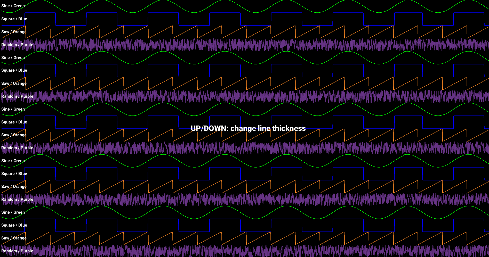
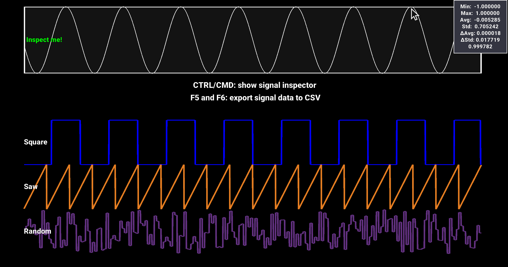
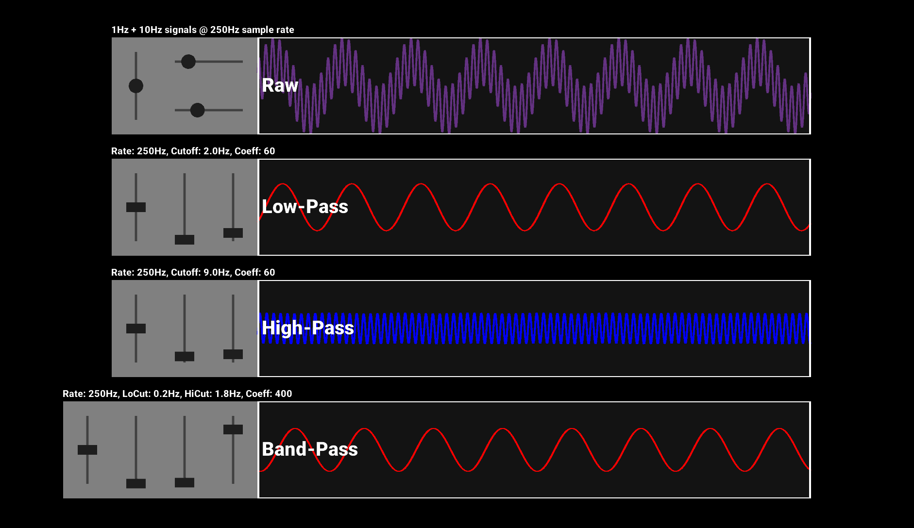
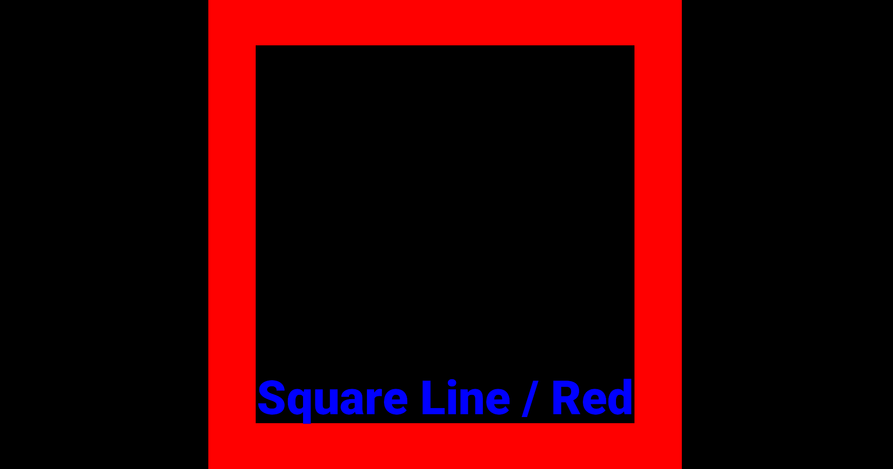
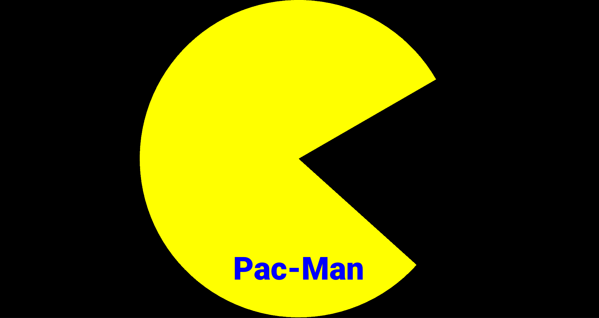
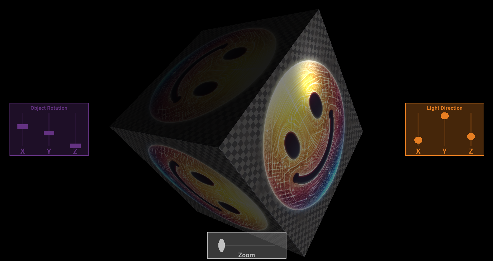

# 2D/3D Graphics Module for Go

## Overview

This is a relatively simple 2D/3D grahpics library originally written with a focus on   
rendering sensor data in realtime, without affecting the routine/process 
responsible for communicating with the sensor (which could be a high-frequency, 
time-sensitive process, etc).  The underlying graphics framework is OpenGL. 

---

## Features

 |                                                                |   |
 |----------------------------------------------------------------|:-:|
 | Dead-simple API for rendering basic/common shapes              | ✅ |
 | Performant line-graph intended for realtime signal analysis    | ✅ |
 | Texture and blur support (for blur, 2D only)                   | ✅ |
 | Ambient, diffuse, specular lighting support (3D only)          | ✅ |
 | Camera, light, and custom viewport support (3D only)           | ✅ |
 | Text rendering and custom (TTF) font support (2D only)         | ✅ |
 | Interface-based and object-oriented for flexible customization | ✅ |


---

## Prerequisites 

Developed/tested on:

| Operating System  | Kernel               |
|:------------------|:---------------------|
| Ubuntu Base 22.04 | 5.15.0-86-lowlatency |

<br/>

Compiler (**Go v1.20**): 
```shell
 wget https://go.dev/dl/go1.20.10.linux-amd64.tar.gz
 sudo tar -C /usr/local -xzf go1.20.10.linux-amd64.tar.gz
 export PATH=$PATH:/usr/local/go/bin
```
For more assistance installing Go, check out the [docs](https://go.dev/doc/install).

Install required packages (Debian/Ubuntu):
```shell
sudo apt install libgl1-mesa-dev libglfw3-dev libfreetype6-dev  
```

## Usage 

See the code in the `examples` directory to get started or execute the `run.sh` script to see it in action!

## Screenshots

  



  

  

  

  

  
