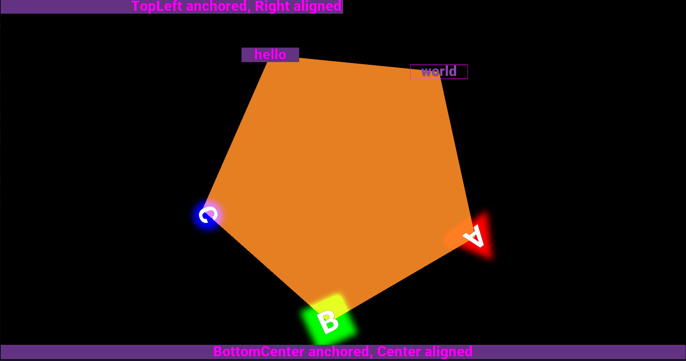
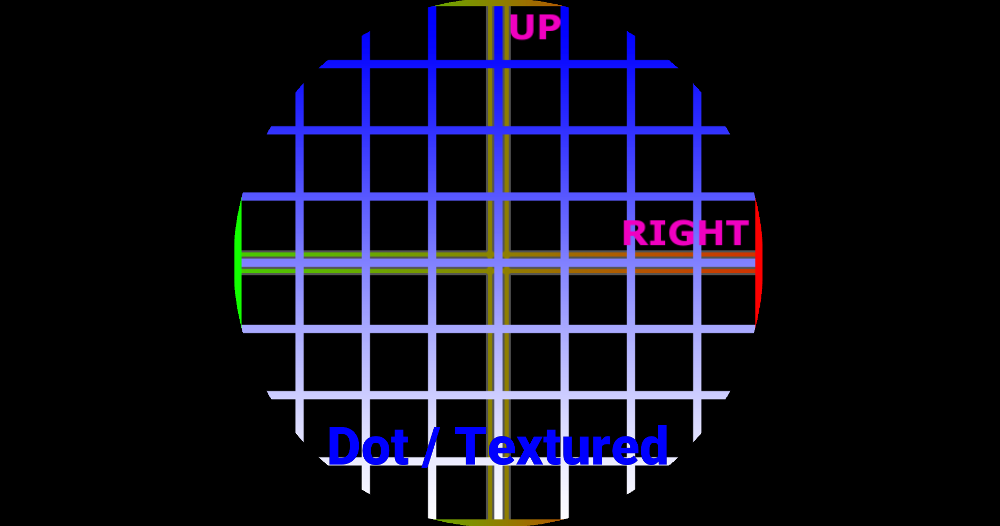
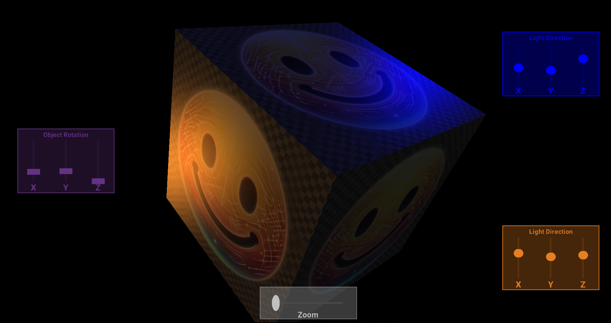

# 2D/3D Graphics Module for Go

## Overview

This is a relatively simple 2D/3D graphics library originally written with
a focus on rendering sensor data in realtime, without affecting the
routine/process responsible for communicating with the sensor (which could
be a high-frequency, time-sensitive process, etc.) The underlying graphics
framework is [OpenGL](https://www.opengl.org/), with window management and user input handled 
using [GLFW](https://www.glfw.org/).

---

## Features


|                                                                  |   |
|------------------------------------------------------------------|:-:|
| Dead-simple API for rendering shapes, text and more!             | ✅ |
| Common UI controls: Label, Button, Slider, Checkbox, RadioButton | ✅ |
| Performant line graph intended for realtime signal analysis      | ✅ |
| Hi/low/band-pass and custom (user-defined) filtering             | ✅ |
| FFT and custom (user-defined) transformers                       | ✅ |
| Ambient/diffuse/specular/emissive/transparent lighting           | ✅ |
| Diffuse/normal/specular map support                              | ✅ |
| Custom struct-to-shader uniform/buffer binding                   | ✅ |
| Custom camera, lighting, and viewport support                    | ✅ |
| Wavefront OBJ/MTL importer                                       | ✅ |
| Text rendering using TrueType fonts                              | ✅ |
| Multiple/transparent/borderless windows                          | ✅ |
| Interface-based and object-oriented for flexible customization   | ✅ |

---

## Prerequisites

Developed/tested on:


| Operating System                       | Kernel               |
|:---------------------------------------|:---------------------|
| Ubuntu Base 22.04.3 + GNOME 42.9 / X11 | 5.15.0-86-lowlatency |

<br/>

Compiler (**Go v1.20**):

```shell
 wget https://go.dev/dl/go1.20.10.linux-amd64.tar.gz
 sudo tar -C /usr/local -xzf go1.20.10.linux-amd64.tar.gz
 export PATH=$PATH:/usr/local/go/bin
```

For more assistance installing Go, check out the [docs](https://go.dev/doc/install).

Install required packages (Debian/Ubuntu):

```shell
sudo apt install libgl1-mesa-dev libglfw3-dev libfreetype6-dev  
```

---

## Testing

Running the included tests is a great way to ensure your system has the
required hardware and prerequisites installed to use this library. Simply
navigate to the `_test` directory and execute the `run_tests.sh` script:

```shell
cd _test
./run_tests.sh
```

Included is a mix of unit and smoke tests, the latter of which requires the creation of windows to render testable scenes to the framebuffer. Obviously,
those tests will only succeed when executing in the context of a GUI-enabled OS
environment supported by GLFW.

---

## Examples

If you prefer to learn by example, check out the code in the `examples`
directory. Most, if not all, of the features are flexed in those examples.

Each example application assumes it is running from that example's root
directory, which is the one containing the `main.go` file. In that directory
is also a script named `run.sh`, which you can execute to run the application 
or, if you prefer to run/debug using an IDE, just ensure that you set the 
**working directory** accordingly in the "run configuration" or "debug 
settings" of your IDE when running examples that load assets using relative
paths to files (and not references to _embedded_ files, as done in other
examples).

---

## Usage

### Initialization, Running & Cleanup

Before doing anything else (especially before spawning a new Go routine),
you should initialize the package by calling the `gfx.Init` function:

```go
if err := gfx.Init(); err != nil {
    panic(err)
}  
```

Most notably, that will initialize GLFW, which is necessary for most of the
things you can do with this library. Since it's required to initialize GLFW
from the application's main thread, so too must it be required to call 
`gfx.Init()` from the main thread. To facilitate that requirement, given 
that the Go runtime decides which underlying OS threads our Go routines will 
run on, it is highly recommended to call `gfx.Init()` as soon as possible, 
which requires the importing of this package, therefore triggering the runtime 
to automatically invoke `gfx.init()` (the unexported version) on application 
startup, before executing `main()`. The `gfx.init` function calls 
`runtime.LockOSThread()`, which will ensure that the thread assigned to the 
currently running Go routine will not be reassigned to another routine...the 
hope being that thread is the main thread and we can then ensure all 
subsequent OpenGL/GLFW calls are made on the Go routine to which the main 
thread was assigned.

Closing the package results in closing any windows that were initialized and 
terminating GLFW. This can be done by calling the `gfx.Close` function:

```go
gfx.Close()
```

Unlike with initialization, you can call that function from any routine, at any
time, but in many cases you can simply have it deferred until returning from 
`main()`. If closed, you must call `gfx.Init()` again if you need to use the 
package once more.

In between initializing and closing the package, you'll be running the `gfx` 
"engine," managing window instances and the objects/services/assets associated 
with each. The details of the latter will be covered more later, but running the 
engine simply means calling the `gfx.Run` function from the "main" routine while 
the latter usually happens on worker routines. The engine then updates/renders any 
windows you have spawned at an interval based on the target framerate (see 
[Global Configuration](#global-configuration)). That process represents the main 
application loop and will execute indefinitely, until one of the following 
conditions is met:

* the last **primary** window is closed
* `gfx.Close()` is called
* the `context.Context` passed to `gfx.Run()` is canceled

The typical pattern for using this library will look like:

```go
package main

import (
    "context"
    "tonysoft.com/gfx"
)

func main() {
     if err := gfx.Init(); err != nil {
         panic(err)
     }
     defer gfx.Close()

     // Configure the window(s)
     // Load assets and add to the window's asset library
     // Configure window services/objects
     // Add services/objects to the window(s)
     // Initialize the window(s)
     // Start any worker routines
     // Run the engine, blocking until the context is canceled:
     gfx.Run(context.WithCancel(context.Background()))
     // ...but store a reference to the cancel function if 
     // you plan to stop the engine that way!
}
```

From this point on in the document, it's assumed that the code presented 
is executed after `gfx.Init()` but before `gfx.Run()` is called.  

### Global Configuration

At the package level, there are currently only two configuration parameters:


| Parameter        | Setter                        | Description                                                                                                                                                      |
|:-----------------|:------------------------------|:-----------------------------------------------------------------------------------------------------------------------------------------------------------------|
| Target Framerate | `gfx.SetTargetFramerate(int)` | The target framerate, in frames per second*.                                                                                                                     |
| V-Sync           | `gfx.SetVSyncEnabled(bool)`   | If enabled, prevents "screen tearing" by setting the [swap interval](https://www.glfw.org/docs/3.0/group__context.html#ga6d4e0cdf151b5e579bd67f13202994ed) to 1. |

*Limiting the framerate, or frames per second (FPS), will result in putting the
main thread to sleep so that other, higher-priority threads/processes (such as
those acquiring/timestamping samples from a sensor, etc) can work. Sleeping is
not a precise action, nor is the implementation of the framerate-limiting logic
found in this module, so do not expect the effective FPS to be precisely on
target-- even in optimal conditions. To disable framerate limiting, the only 
option at this time is to just use a high target framerate setting (e.g., `9999`). 
With V-Sync enabled, the update/tick rate for windows will not exceed the current 
refresh rate of the monitor. 

### Window Creation

All exported `gfx` types should be created using their associated "New-" function and
windows are no different. The type for them is `Window` and one can be created via
the `gfx.NewWindow` function:

```go
win := gfx.NewWindow()
```

### Window Configuration

Configuration of most types can be done via a series of chained method calls, like so:

```go
win := gfx.NewWindow().
    SetTitle("This text appears in the window's title bar, if not a borderless window").
    SetWidth(1920).
    SetHeight(1080).
    SetClearColor(gfx.Black) // can use an out-of-the-box color or any color.RGBA 
```

By default, windows will initially be displayed at the center of the screen,
however you can always specify the window's position via `SetPosition()`
(either before or after the window has been displayed). Any of the configuration
functions (that begin with "Set-") can be called after the window has been
created/displayed, meaning you can change those aspects of the window at any time.
Some configuration options must be specified at the time of creation, however, and
those options are referred to as window "hints" (as per GLFW lexicon) and must be
passed into the `gfx.NewWindow` function.

Currently, the following hints are supported:


| Hint           | Description                                                                                                                       |
|:---------------|:----------------------------------------------------------------------------------------------------------------------------------|
| Borderless     | If true, the window will not be "decorated," meaning it will not have a title bar or border.                                      |
| Resizeable     | If true, the maximize button in the title bar will not be enabled/visible and resizing via border gripping/dragging is disabled*. |
| Multi-sampling | If true, will enable anti-aliasing via OpenGL's native MSAA feature, with the sample count set to 4.                              |

*Resizing and going fullscreen is still possible programmatically and the
`Window` type provides functions for those actions.

Example creating a borderless window with 4xMSAA enabled:

```go
borderless := true
resizeable := false
msaa := true
win := gfx.NewWindow(gfx.NewWindowHints(borderless, resizable, msaa))
```

More configuration options are available for `Window` and are demonstrated
in the included examples and tests.

### Window Initialization

Like most `gfx` types, `Window` instances must be initialized and like all 
life-cycle functions (see [related section](#life-cycle-functions)), should be done on the main 
thread. That particular concern is handled for you by the `gfx.InitWindowAsync`
function, which you can call from any routine, at any time, to have a window 
initialized:

```go
gfx.InitWindowAsync(win)
```

Note the "-Async" suffix, which is indication that the function will not
block but will result in queuing work to be performed on another routine
(in this case, the one locked to the main thread). If you need to perform
some action as soon as the window is initialized, you can do this:

```go
gfx.InitWindowAsync(win)
<-win.ReadyChan()
```

Assuming the engine is running (`gfx.Run()` has been called), once the
window has been initialized, it will be displayed on the screen (or not,
depending on how it was configured), and will be updated/ticked as per
the target framerate.

### Window Destruction

Explicitly closing/destroying a window is only necessary in a multi-window
scenario, when additional windows are presented but at some point may need
to be closed without that resulting in closing the entire application. By
default, every window has "primary" status, meaning that closing such a
window, if it has been initialized, will result in the application closing.
To prevent that behavior, such as when additional windows are used for
pop-up/modal dialogs, pass `true` to the `SetSecondary` function provided 
by `Window`:

```go
msgWin.SetSecondary(true) // can call any time
```

And to close:

```go
gfx.CloseWindowAsync(msgWin) // can call from any routine
```

Note that calling `gfx.Close()` will result in closing all remaining
initialized windows, ensuring the `Close` function is called for
all objects/services/assets associated with them before returning.

### Life-cycle Functions


| Name   | Description                                                                                                                                                              |
|:-------|:-------------------------------------------------------------------------------------------------------------------------------------------------------------------------|
| Init   | Called once, but implementations should be idempotent; may change the state of the OpenGL context or result in allocation of RAM/VRAM, etc.                              |
| Update | Called during each window "tick," as per the target framerate; will usually be passed the delta-time in microseconds and will not do anything if the object is disabled. |
| Draw   | Called after `Update`; will usually be passed the delta-time in microseconds and will not render anything if the object is invisible.                                    |
| Close  | Called once, but implementations should be idempotent; should release reserved RAM/VRAM, destroy/unbind OpenGL resources, etc.                                           |


Life-cycle functions are those found throughout the `gfx` package with the names
`Init`, `Update`, `Draw`, and `Close`. Except for the package-level functions
already introduced, `gfx.Init` and `gfx.Close`, these special functions should
not be directly invoked as some must be executed on the main thread and many in
coordination with other changes being made to the active OpenGL context. These
functions are defined in many interfaces and are only exported so that you can
provide custom implementations (see [Advanced Usage](#user-defined-types)). Note 
that while their signatures may vary slightly, with different arguments and 
return types, it's their name that identifies them as being a life-cycle function.

### Objects & Services

Many of the `gfx` types implement the `Object` interface, which includes the 
`Init`, `Update`, and `Close` functions; the `DrawableObject` interface adds 
the `Draw` function. Types implementing these interfaces are usually added to 
`Window` instances for full life-cycle management. The `Window` type also 
provides functions for ad-hoc initialization/closure, including both synchronous 
and asynchronous variants:  

```go
// Let the window manage the object, updating/drawing it each tick 
// and closing it when the window closes
quad := gfx.NewQuad()
win.AddObject(quad)

// But if you need to close it sooner:
win.CloseObject(quad) // will block until closed

// These objects will not be updated/drawn on each tick
myObj := SomeObject()
win.InitObject(myObj) // will block until initialized
myObj2 := SomeObject()
win.InitObjectAsync(myObj2) // will not block

// When it's time to close:
win.CloseObject(myObj) 
win.CloseObjectAsync(myObj2)
```

Services are special objects that implement the `Service` interface, which 
includes the `Object` interface, and are also added to `Window` instances for 
life-cycle management. The main difference between services and objects is 
that the former are always initialized/updated before the latter. Objects 
and services are processed in separate queues, in LIFO order (so technically 
they're treated as "stacks"), with services always processed before objects. 
This is particularly important as it relates to asset loading and usage, as 
described in the next section. 

### Assets

Types that implement the `Asset` interface are similar to objects in that 
they usually need to be initialized and closed, but not updated/drawn on 
each tick. Additionally, they need to be initialized before the objects 
that depend on them are initialized. To facilitate this, the `AssetLibrary` 
service exists, which ensures the assets it manages are initialized and 
closed properly. Examples of assets are textures, fonts, and shaders.  

By default, the `Window` type will include an instance of the `AssetLibrary` 
service that you can access via the `Assets` function. Note that you will 
likely need to use type-assertion before manipulating an asset or using it 
as an argument to a function expecting a particular type of asset, etc:  

```go
// Optimistic retrieval
myShader := win.Assets().Get("my_shader").(Shader)
myShader.Activate() // example usage

// Safe retrieval
if asset := win.Assets().Get("my_shader"); asset != nil {
    if myShader, ok := asset.(Shader); ok {
        myMaterial.AttachShader(myShader) // example usage
    }
}
```

Of course, you can create more instances of the `AssetLibrary` service to 
manage your assets, perhaps assigning one for each stage/scene. Just remember 
to add the service to the window!

### Shape2D

For two-dimensional shapes, the `Shape2D` type and its associated "New-" 
functions can be used. These functions simply return `Shape2D` instances 
that have had their "Sides" and "Thickness" properties configured accordingly.  

For example, `gfx.NewQuad()` will return a `Shape2D` that has four sides and 
no thickness, meaning that its color or texture will fill the entirety of the 
shape. On the other hand, `gfx.NewSquare(.2)` will return a `Shape2D` that 
also has four sides but with a line thickness set to 20%, resulting in a 
square line / frame-like shape. For polygons with more sides than a 
quadrangle, you will need to call `gfx.NewShape2D()` and set the desired 
number of sides via the `SetSides` function. For circles and dots (filled-in 
circles), you can either do the same with a value of your choosing or you can 
call the `gfx.NewCircle`/`gfx.NewDot` functions, which use a value of 90. 

As alluded to, `Shape2D` instances can be colored, textured, or even both
(to tint the texture). You can also enable a blur effect with a variable 
intensity. Finally, composite shapes can be created simply by adding other 
`Shape2D` instances as children (as this type implements `WindowObject`).  

Bringing it all together with a simple example, here we create a stop sign 
using two `Shape2D` instances and one `Label` instance for the sign's verbiage:  
```go
stopSign := gfx.NewShape2D()
stopSign.
    SetSides(8).  // of course we need an octagon
    SetThickness(.1).  // this shape is just for the outer white line
    SetColor(gfx.White).  // the default color is white, so this isn't necessary
    SetScale(mgl32.Vec3{.7, .7}).  // it will be 70% of the window size
    SetRotationZ(mgl32.DegToRad(22.5))  // the rotation needs to be adjusted for a stop sign

stopSignFill := gfx.NewShape2D()
stopSignFill.
    SetSides(8).  // the inner fill shape will also be an octagon
    SetColor(gfx.Red).  // red fill, of course
    SetScale(mgl32.Vec3{.9, .9})  // the line has .1 thickness, so we scale down to not overlap

stopSignText := gfx.NewLabel()
stopSignText.
    SetText("STOP").
    SetFontSize(.3).  // text height will be 30% the size of parent (or window if no parent)
    SetRotationZ(mgl32.DegToRad(-22.5))  // must negate the rotation imposed by parent

// We add the fill/text objects as children, that way we can just deal with one
// object and the children can inherit properties like position, scale, etc, from
// the parent, simplifying the initial configuration and future transformations.
stopSign.AddChildren(stopSignFill, stopSignText)

// From the window's perspective, there is just the one object to manage
win.AddObjects(stopSign)
```
That should produce this result:  


To learn more about what's possible with `Shape2D`, please see 
the examples.  

### Shape3D

For three-dimensional shapes, there is the `Shape3D` type and its associated 
"New-" function. Unlike with `Shape2D`, you are on the hook to provide the 
geometry (vertex data), which is done by passing an object that implements 
the `Model` interface to the `SetModel` function.  

A `Model` represents a collection of `Mesh` instances; a `Mesh` represents a 
collection of `Face` instances; and a `Face` defines which vertices and 
associated attributes should be used to render that particular polygon, as well 
as which `Material` to use when shading. Faces can be defined using 3 or 4 
vertices and reference vertex positions, normals, texture coordinates, etc, by 
way of indexing...just like the Wavefront OBJ format, which these interfaces 
were modeled after. In fact, the `obj` package (found in this module) contains 
an implementation of these interfaces that you can use to easily import OBJ 
(Object) and MTL (Material Library) files. `Model` and `Material` are also 
examples of assets, as they include the `Asset` interface in their definition, 
and are meant to be shared across `Shape3D` instances.

Unless your model's vertex position data is already in the normalized, 
device/screen space, you will also need to supply a `Camera` to the `SetCamera` 
function. `Camera` is yet another interface but an implementation is at 
your disposal and can be created by calling `gfx.NewCamera()`. As with 
most frameworks, this object is used to apply its view-projection matrix
to the world matrix of all objects it's assigned to, ensuring they're all 
rendered from the same perspective and to of course transform the model's 
vertices from local to device/screen space.  

Finally, you will want to provide a suitable, shader-bindable object to 
set the model's lighting properties in the shader. If you are using a 
shader that does not take lights into account, such as the 
`gfx.Shape3DNoLightsShader` shader, then you can skip this step. Otherwise, 
you would pass in this object to the `SetLighting` function. For example, 
the `gfx.Shape3DShader` shader supports up to four directional lights, which 
can be configured using an instance of `QuadDirectionalLighting`. More 
information on shader-bindable objects is included in the 
[Advanced Usage](#shader-data-binding) section. 

Complete examples for both creating a `Model` in memory and loading from an 
OBJ file are included, but here is a shortened example of the latter:  

```go
model := obj.NewModel("my_model", "my_model.obj")
model.ComputeTangents(true)
win.Assets().Add(model)

camera := gfx.NewCamera()
// ...set properties
win.AddObject(camera)

lighting := gfx.NewQuadDirectionalLighting()
// ...set properties

myShape := gfx.NewShape3D()
myShape.
    SetModel(model).
    SetCamera(camera).
    SetLighting(lighting)

win.AddObjects(myShape)
```

### Labels & Fonts

Text rendering is handled by the `Label` type, which is able to render TrueType 
fonts (thanks to the awesome [freetype](https://github.com/golang/freetype) library). 
The `Label` type will use the Roboto font by default, otherwise it will use the one 
provided to the `SetFont` function, which expects an object that implements the 
`Font` interface. The `TrueTypeFont` type is one such implementation, encapsulating 
the functions of the `freetype` library (`truetype` package) used to load TTF files 
into memory. As an `Asset`, `Font` instances should be added to an `AssetLibrary` for life-cycle 
management.  

Example using a provided TrueType font:  
```go
coolFont := gfx.NewFont("cool_font", "cool.ttf")
win.Assets().Add(coolFont)
	
// One method for positioning in the bottom-right corner, which
// requires that we shorten the horizontal scale of the label
// from 1.0 (the entire width of the parent or window) to
// something that tightly contains the text, given the font
// size. Note that the horizontal scaling does not affect
// the width or stretching of the text itself, but rather can
// be thought of as the size of the label's container or frame.
hello := gfx.NewLabel()
hello.
    SetText("hello!").
    SetFont(coolFont).
    SetFontSize(.1).
    SetAnchor(gfx.BottomRight).
    SetColor(gfx.Green).
    SetScaleX(.25)

win.AddObjects(hello)
```

More example `Label` usage can be found in the included examples and tests.

### UI Controls

In addition to labels for text rendering, this library comes with several 
common (and not so common) user interface controls:  


| Type              | Short Description                                                                                       |
|:------------------|:--------------------------------------------------------------------------------------------------------|
| `Button`          | Can be clicked or depressed to trigger further action.                                                  |
| `Slider`          | Draggable button on a rail, used to represent a value within a range.                                   |
| `CheckButton`     | (aka, checkbox) Can be clicked to toggle a binary "checked" state.                                      |
| `RadioButton`     | Like `CheckButton`, but meant to be used in a group where only one can have a positive "checked" state. |
| `SignalLine`      | Used to render a sample stream in real-time, in the form of a line graph.                               |
| `SignalGroup`     | Used to render multiple, related signal lines.                                                          |
| `SignalInspector` | Used to display the signal value at the position of the mouse cursor as well as aggregated metrics.     |
| `FpsCounter`      | Used to display the effective "tick" rate of an object (a close approximation of the framerate).        |

Example usage of these controls can be found in both the included examples and tests.  

---

## Advanced Usage

### User-defined Types

The aim of this library is to provide the simplest API possible, without being 
restrictive or limited. To that end, interfaces are employed extensively and 
implementing them usually begins with embedding the associated "-Base" type.  

For example, you don't need to create a new type to load a custom shader 
program if it's just comprised of a vertex, fragment, and (optionally) a 
geometry shader. That's because the `BasicShader` type, which implements 
`Shader`, can handle the compilation/linking of those specific types of 
shaders. If, however, you needed to incorporate tessellation or wanted to 
utilize a compute shader, then you would need to create your own implementation 
of `Shader` and that would likely begin with creating a type that embeds 
`ShaderBase`:  

```go
type ComputeShader struct {
    gfx.ShaderBase
}
```

This is done so that you only need to implement/override what is relevant 
to the custom behavior of your new type, but of course it's completely 
optional.  

In the case of a tessellation-capable shader, perhaps it would make more sense 
to embed `BasicShader`, add members for the tessellation shader sources, and 
then override `Init()` to handle the loading, compilation, and linking of the 
shaders:  

```go
type TessellationShader struct {
    gfx.BasicShader // defines the other shader sources for us

    tcSource any // control shader source
    teSource any // evaluation shader source
}

func (s *TessellationShader) Init() (ok bool) {
    // Load/compile/link... binding
}
```

As another example, we'll compare two different ways we can go about 
automating the rotation of a `Shape2D`, which illustrates an important 
aspect of this type's design and that of many others.  

The most direct way is to simply call the `SetRotationZ` function at 
some interval on a worker routine:  

```go
triangle := gfx.NewShape2D()
win.AddObjects(triangle)

ctx, cancelFunc := context.WithCancel(context.Background())

go func(w *gfx.Window, c context.Context) {
    <-w.ReadyChan()
    angleStep := 0
    speed := float32(.025)
    // We attempt to update the rotation at the same frequency the shape 
    // is rendered on the screen; doing it slower will increase "choppiness" 
    // while faster would mean more contention on the shape's state mutex.
    sleepTimeMilli := 1000 / gfx.TargetFramerate()
    for {
        select {
        case <-ctx.Done():
            return
        default:
        }
    
        angleStep++
        triangle.SetRotationZ(float32(angleStep) * speed)
        time.Sleep(time.Duration(sleepTimeMilli) * time.Millisecond)
    }
}(win, ctx)
```

As noted in the comments, calling `SetRotationZ` will result in locking 
the shape's state mutex, which is also locked on each `Draw` invocation. 
That's just one aspect of this approach that is undesirable, with the other 
being that it relies on sleeping to achieve the ideal update frequency, given 
the desire to minimize contention on the mutex while aiming for the smoothest 
possible rotation. Sleeping can be imprecise or inconsistent, which can result 
in choppiness. Finally, while this approach might be fine in some applications, 
it certainly isn't very scalable...both from a coding and resource perspective.

The other approach is to create a new type that either wraps or embeds `Shape2D`:  
```go
type SpinningShape2D struct {
    gfx.Shape2D // choosing the embedded approach here
    angleStep int
    speed float32
}

func (s *SpinningShape2D) Update(deltaTime int64) (ok bool) {
    if !s.Shape2D.Update(deltaTime) { // only update if enabled/initialized
        return false
    }

    s.angleStep++
    s.SetRotationZ(float32(s.angleStep) * s.speed)
    return true
}

// Not thread-safe! 
func (s *SpinningShape2D) SetSpinSpeed(speed float32) *SpinningShape2D {
    s.speed = speed // use a mutex or atomic type if expecting changes while drawing
    return s
}

func NewSpinningShape2D() *SpinningShape2D {
    return &SpinningShape2D{
        Shape2D: *gfx.NewShape2D(), // get good defaults
    }
}
```
Then, inside `main()`:

```go
triangle := NewSpinningShape2D()
triangle.SetSpinSpeed(.01)
win.AddObjects(triangle)
```

What's clear from the second approach is that it takes more "setup" code, creating 
the new type in advance, but once it comes time to use the type it's far more 
concise (as one would expect when using an object that encapsulates the work). 
Additionally, if you visually compare the two approaches while running the code, 
and you have a keen eye, you can see the slight choppiness with the first one in 
some cases while it's not observed with the second. This is because there is no 
contention on the shape's state mutex and sleeping isn't involved. 

### Shader Data Binding

When you need to create a new implementation of `Material` or a new lighting 
object, you will then have to work with shader-bindable structs, which are 
essentially used to send data from RAM to VRAM for use by your shaders. These 
are structs that contain **exported** members that are of one of the supported 
**bindable types**, each mapping to a particular GLSL type. Additionally, these 
struct members are given the **same name** (including casing) as the variables/buffers 
they map to in the shader, sans the required `u_` prefix given to the names of 
shader uniform variables; without the prefix, shader binding will not occur. Note 
that it's perfectly fine for such structs to include non-bindable members.  

Supported bindable types and their associated GLSL types:  


| Go Type(s)                              | GLSL Type                             |
|:----------------------------------------|:--------------------------------------|
| `float32`                               | float                                 |
| `int32`                                 | int                                   |
| `uint32`                                | uint                                  |
| `mgl32.Mat4`, `f32.Mat4`, `[16]float32` | mat4                                  |
| `mgl32.Mat3`, `f32.Mat3`, `[9]float32`  | mat3                                  |
| `mgl32.Vec4`, `f32.Vec4`, `[4]float32`  | vec4                                  |
| `mgl32.Vec3`, `f32.Vec3`, `[3]float32`  | vec3                                  |
| `mgl32.Vec2`, `f32.Vec2`, `[2]float32`  | vec2                                  |
| `SomeStruct`, `SomeInterfaceNotTexture` | struct                                |
| `[]SomeStruct`                          | []struct                              |
| `*SomeStruct`                           | uniform buffer object (std140 layout) |
| `gfx.Texture`                           | sampler2D                             |


For example, consider a shader with the following uniform defined:
```glsl
uniform float u_SomeFactor;
```

To bind a field to that uniform, it would need to be defined like this in the 
binding struct:  
```go
type MyMaterial struct {
    gfx.MaterialBase
    SomeFactor float32
}
```

And if you'd like to bind to this `sampler2D`:
```glsl
uniform sampler2D u_SomeMap;
```

...then you would do this:  
```go
type MyMaterial struct {
    gfx.MaterialBase
    SomeMap gfx.Texture 
}
```

For uniform buffer objects, a special exception exists... but first, the rule. For this UBO:    
```glsl
layout (std140) uniform MyMaterial { // this is the name that matters
    vec4 SomeProp1;
    vec4 SomeProp2;
} u_Material; // the instance name is optional and can be anything
```

...you can, of course, do this:  
```go
type MyMaterial struct {
    gfx.MaterialBase
    SomeMap gfx.Texture 
    MyMaterial *MyMaterialProperties 
}

type MyMaterialProperties struct { // must have the std140 layout
    SomeProp1 mgl32.Vec4
    SomeProp2 [4]float32 // either of these types will work
}
```

That would work, since the name of the struct's bindable field matches the name 
given to the UBO in the shader, however the naming convention doesn't make for a 
good API-consuming experience, as it will feel redundant and perhaps confusing to 
work with a field member that has the same name as the containing type. To avoid 
this circumstance, an exception exists whereby if the field name is `Properties` 
it will attempt to map to a UBO with the same name as the containing type:  
```go
type MyMaterial struct {
    gfx.MaterialBase
    SomeMap gfx.Texture 
    Properties *MyMaterialProperties 
}
```

...will now bind to the UBO with the name `MyMaterial` and consumers should 
more confident about its usage. 

A final note about shader-bindable structs: they may implement `sync.Locker`, 
in which case it's recommended to call `Lock()` on the object before making any 
changes, then of course `Unlock()` once finished. That will ensure changes are 
not made while currently sending the data to VRAM.

For more examples, check out the implementation of `Material` found in the `obj` 
package (`obj.BasicMaterial`); `gfx.BasicCamera` for an implementation of `Camera`; 
and `gfx.QuadDirectionalLighting` for an example of a "purely" shader-bindable struct, 
not pulling double-duty as an `Asset`, etc.

---

## Screenshots











